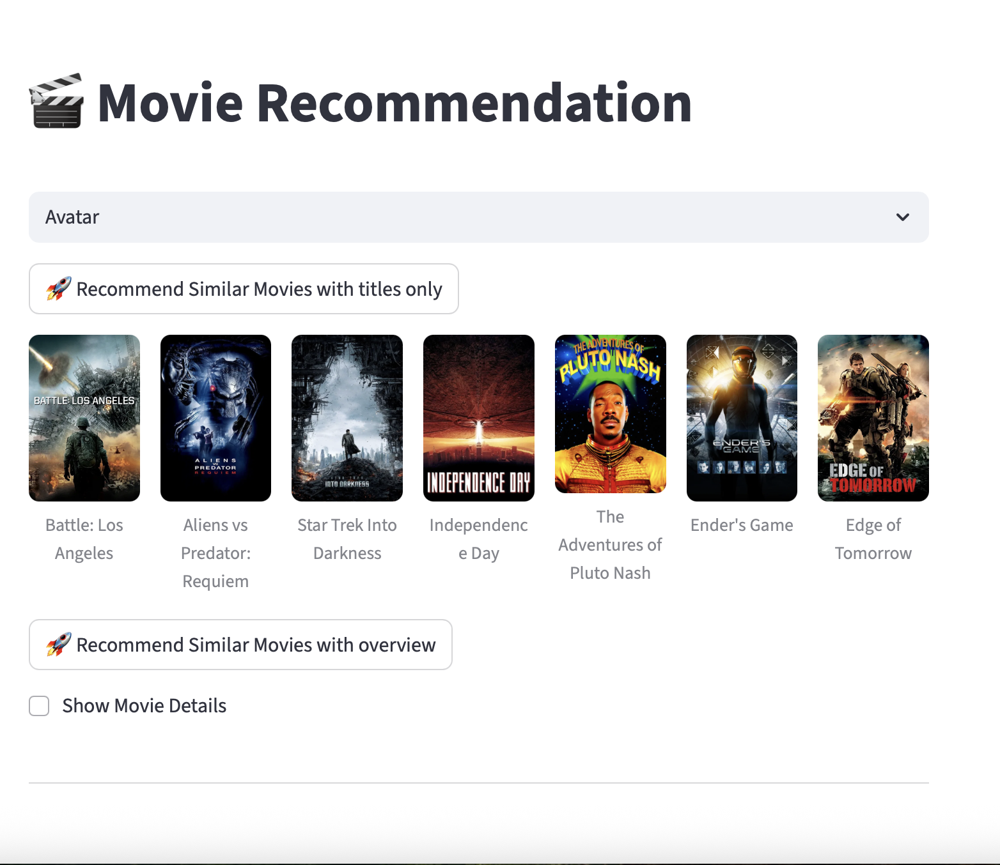
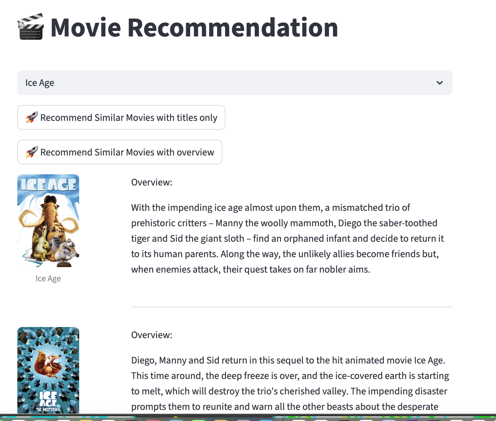
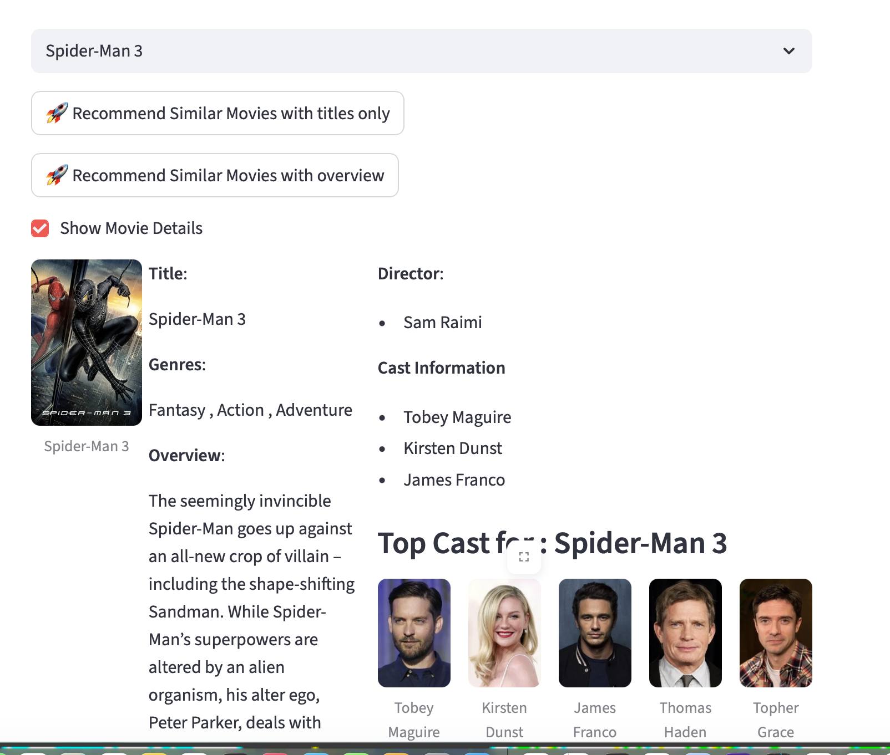

## 🎬 Movie Recommendation System
A content-based recommendation system that utilizes Unsupervised Machine Learning(K Means) to suggest movies based on content.
### Overview 
This project builds a recommendation engine using clustering and similarity measures. It processes movie textual data (genres, keywords, cast, crew) to identify patterns and group similar titles.

Built a recommendation engine using clustering & similarity measures 

#### 🔑 Key Features:
*	**Text Vectorization**: Uses TfidfVectorizer to convert text into numerical values.
*	**Machine Learning**: Implements K-Means Clustering for categorization.
*	**Similarity Scoring**: Uses Cosine Similarity to find the closest movie matches.
*	**Interactive UI**: A Streamlit web application for real-time testing.
*	**Data Visualization**: Includes PCA clusters, Correlation matrices, and Elbow Method plots.
---
#### 🛠  Dependencies: 
Install the required Python packages before running the project 
*	pip install pandas numpy matplotlib scikit-learn joblib streamlit_ 
*	update config.json for API Key

#### 📂 DataSet information: 
*	**tmdb_5000_movies.csv**: Contains budget, genres, homepage, id, keywords, etc.
*	**tmdb_5000_credits.csv**: Contains movie_id, title, cast, and crew.

---

#### ⚙️ Workflow:

1.	#### Data Preparation:  
*	Combine movie and credit datasets on the title/ID.
*	Feature selection: Extract relevant tags (genres, overview, cast, crew).
*	Cleaning: Remove spaces, handle null values, and apply Stemming to reduce words to their root form.
	 
2.	####  Pre-Processing : 
*	**Vectorization**: Transform processed text into a matrix of TF-IDF features.
*	**Clustering**: Apply K-Means to predict movie groupings based on content density.

3.	####  Training & Evaluation: 
*	**Optimal 'k'**: Determine the number of clusters using the Inertia Plot.
*	**Visual Analysis**: Plot a Co-Relation Matrix and apply PCA (Principal Component Analysis) to visualize clusters  in 2D.
*	**Similarity**: Compute a Cosine Similarity matrix for precise recommendations.
  
4.	#### Model Persistence: 
*	Save the trained model and vectorizer using joblib for fast loading without retraining.
---

#### 🚀 Running the Project
*	**Train the Model** 
	Run the training script to process data and generate model files: 
	*	python3 MovieRecommondation.py --train 
*	**Testing of the testModule** 
    *	streamlit run MovieApp.py 
---	
	
#### 📊Expected Outputs :
**Visualisations** 
The system generates the following visualizations in the images/ directory:
*	**Co-Relation.png**: Heatmap of feature relationships.
*	**ClusterVsInertiaPlot.png**: The "Elbow" graph used to find optimal K.
*	**PCA Visualization**: A 2D scatter plot showing how movies are clustered.

---
 #### 🎬 Movie UI :
 
  
  
  

---
#### ✍️ Author
 Vaishali M. Jorwekar 
 Date	:28 Nov 2025 
  

