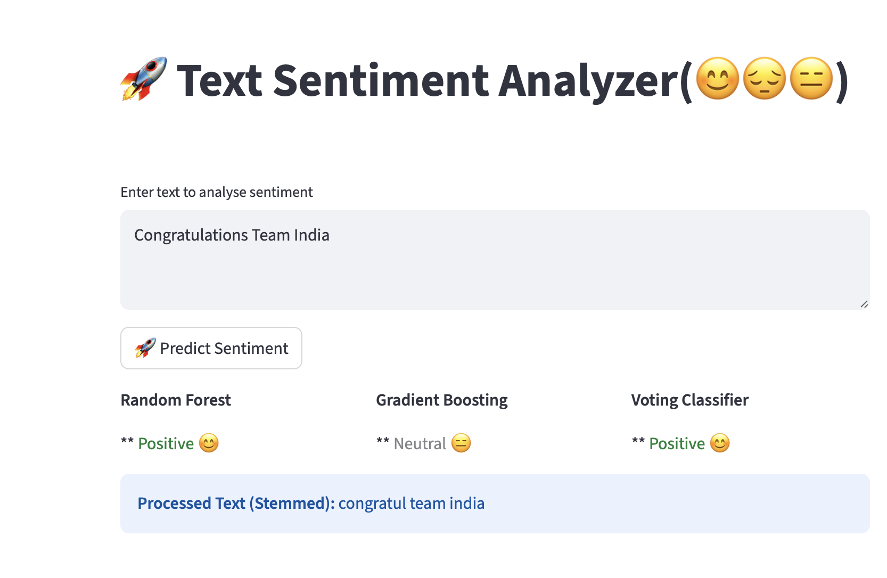

## Twitter Sentiment Analysis 🐦
This project performs sentiment analysis on Twitter data to classify tweets as Positive, 
Negative, or Neutral. It utilizes Natural Language Processing (NLP) techniques and
machine learning classifiers to automate the detection of public opinion.
### 🚀 Key Features
*  **Text Preprocessing**: Automated cleaning including removal of URLs, handles, special characters, and stopwords.
*  **Feature Extraction**: Implementation of TF-IDF (Term Frequency-Inverse Document Frequency) to convert text into numerical vectors.
*  **Multiple Classifiers**: Comparison between popular models such as Random Forest and Gradient Boosting
---
### 🛠 Dependencies
To run this project, install the following libraries:
pip install pandas numpy matplotlib seaborn scikit-learn nltk streamlit

---

### 📊 Dataset Information
The project uses the Tweets.csv dataset, which typically includes:
*  **Features**: textID,text (The raw content of the tweet), selected_text (Key phrases reflecting sentiment).
*  **Target**: sentiment (Labels: Positive, Negative, or Neutral).
---
### ⚙️ Workflow
1. #### Data Preparation
  *  Load Tweets.csv using Pandas.
  *  Drop irrelevant metadata columns and handle missing values in the text field.
    
2. #### NLP Preprocessing
  *  **Lowercasing**: Standardizing all text.
  *  **Tokenization**: Segmenting sentences into individual words.
  *  **Stopword Removal**: Filtering out common words (e.g., "the", "is") using NLTK.
  *  **Stemming**: Reducing words to their root forms.

3. #### Model Training
  *  **Vectorization**: Used TfidfVectorizer to prepare data for the model.
  *  **Training**: Trained classifiers like Random Forest and Gradient Boosying 80/20 train-test split.
   
4. #### Evaluation
  *  Generate a Classification Report (Precision, Recall, F1-Score).
  *  Visualize results with a Confusion Matrix to see where the model misclassifies.
 
---      
### 💻 Running the Project
#####  Train Model
  *  Run the script: python SentimentAnalysis.py     
#####  Test Model with Streamlit
  *  streamlit run SentimentApp.py
---
### 📂 Expected Outputs
*  **Visualizations**: Word clouds for positive, negative and Neutral sentiments and bar charts of sentiment distribution.
*  **Model Performance**: Accuracy scores for each tested algorithm . AccuracyPlot.png.
*  **Confusion Matrix**: ConfusionMatrix.png
*  **classification report**:classification_report.txt
  
---  
### Text Analyser UI
 
  

---
---
#### ✍️ Author
 Vaishali M. Jorwekar 
 Date	:23 Dec 2025 
